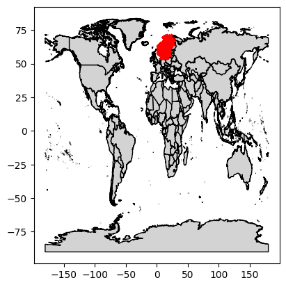
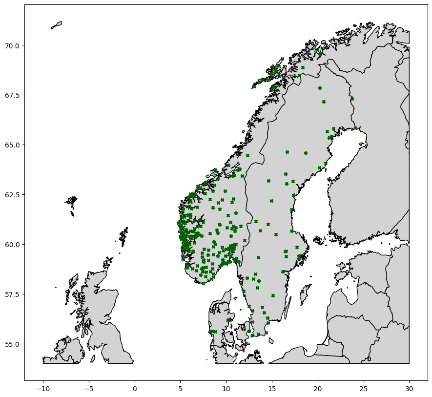

# Notebook \#2:</br> Exploratory Data Analysis
#### by Sebastian Einar Salas Røkholt

---

**Notebook Index**  

- [**1 - Introduction and Notebook Setup**](#1---introduction-and-notebook-setup)  
  - [*1.1 Setup*](#11-setup)  
  - [*1.2  Load cleaned dataset*](#12-load-cleaned-dataset)  
  - [*1.3  Explanation of variables in the dataset*](#13-explanation-of-variables-in-the-dataset) 
- [**2 - Summary Statistics**](#2---summary-statistics)  
- [**3 - Mapping Charging Locations**](#3---mapping-charging-locations)  

## 1 - Introduction and Notebook Setup

### 1.1 Setup


```python
import pandas as pd
import numpy as np
import geopandas as gpd
import matplotlib.pyplot as plt
from shapely.geometry import box


# Notebook settings
%matplotlib inline  
pd.set_option("display.max_rows", None)
pd.set_option("display.max_columns", None)
pd.options.display.float_format = '{:.2f}'.format  # By default, display all floats with two decimals
```

### 1.2 Load cleaned dataset


```python
df = pd.read_parquet("../Data/etron55-charging-sessions.parquet")
df.head()
```


<div>
<style scoped>
    .dataframe tbody tr th:only-of-type {
        vertical-align: middle;
    }

    .dataframe tbody tr th {
        vertical-align: top;
    }

    .dataframe thead th {
        text-align: right;
    }
</style>
<table border="1" class="dataframe">
  <thead>
    <tr style="text-align: right;">
      <th></th>
      <th>charging_id</th>
      <th>minutes_elapsed</th>
      <th>progress</th>
      <th>timestamp</th>
      <th>power</th>
      <th>rel_power</th>
      <th>d_power</th>
      <th>d_power_ema3</th>
      <th>soc</th>
      <th>d_soc</th>
      <th>d_soc_ema3</th>
      <th>energy</th>
      <th>nominal_power</th>
      <th>charger_cat_low</th>
      <th>charger_cat_mid</th>
      <th>charger_cat_high</th>
      <th>temp</th>
      <th>lat</th>
      <th>lon</th>
      <th>charger_category</th>
      <th>timestamp_H</th>
      <th>timestamp_d</th>
      <th>nearest_weather_station</th>
    </tr>
  </thead>
  <tbody>
    <tr>
      <th>0</th>
      <td>0</td>
      <td>0</td>
      <td>0.00</td>
      <td>2020-01-11 12:37:00</td>
      <td>89.44</td>
      <td>0.50</td>
      <td>0.00</td>
      <td>0.00</td>
      <td>40.00</td>
      <td>0.00</td>
      <td>0.00</td>
      <td>0.32</td>
      <td>150.00</td>
      <td>0.00</td>
      <td>1.00</td>
      <td>0.00</td>
      <td>4</td>
      <td>59.67</td>
      <td>9.65</td>
      <td>Ultra</td>
      <td>2020-01-11T12</td>
      <td>2020-01-11</td>
      <td>SN28380</td>
    </tr>
    <tr>
      <th>1</th>
      <td>0</td>
      <td>1</td>
      <td>0.14</td>
      <td>2020-01-11 12:38:00</td>
      <td>92.75</td>
      <td>0.52</td>
      <td>3.31</td>
      <td>1.66</td>
      <td>41.00</td>
      <td>1.00</td>
      <td>0.50</td>
      <td>1.84</td>
      <td>150.00</td>
      <td>0.00</td>
      <td>1.00</td>
      <td>0.00</td>
      <td>4</td>
      <td>59.67</td>
      <td>9.65</td>
      <td>Ultra</td>
      <td>2020-01-11T12</td>
      <td>2020-01-11</td>
      <td>SN28380</td>
    </tr>
    <tr>
      <th>2</th>
      <td>0</td>
      <td>2</td>
      <td>0.23</td>
      <td>2020-01-11 12:39:00</td>
      <td>94.81</td>
      <td>0.53</td>
      <td>2.06</td>
      <td>1.86</td>
      <td>43.00</td>
      <td>2.00</td>
      <td>1.25</td>
      <td>3.41</td>
      <td>150.00</td>
      <td>0.00</td>
      <td>1.00</td>
      <td>0.00</td>
      <td>4</td>
      <td>59.67</td>
      <td>9.65</td>
      <td>Ultra</td>
      <td>2020-01-11T12</td>
      <td>2020-01-11</td>
      <td>SN28380</td>
    </tr>
    <tr>
      <th>3</th>
      <td>0</td>
      <td>3</td>
      <td>0.29</td>
      <td>2020-01-11 12:40:00</td>
      <td>95.68</td>
      <td>0.53</td>
      <td>0.87</td>
      <td>1.36</td>
      <td>45.00</td>
      <td>2.00</td>
      <td>1.62</td>
      <td>5.00</td>
      <td>150.00</td>
      <td>0.00</td>
      <td>1.00</td>
      <td>0.00</td>
      <td>4</td>
      <td>59.67</td>
      <td>9.65</td>
      <td>Ultra</td>
      <td>2020-01-11T12</td>
      <td>2020-01-11</td>
      <td>SN28380</td>
    </tr>
    <tr>
      <th>4</th>
      <td>0</td>
      <td>4</td>
      <td>0.34</td>
      <td>2020-01-11 12:41:00</td>
      <td>96.88</td>
      <td>0.54</td>
      <td>1.20</td>
      <td>1.28</td>
      <td>47.00</td>
      <td>2.00</td>
      <td>1.81</td>
      <td>6.60</td>
      <td>150.00</td>
      <td>0.00</td>
      <td>1.00</td>
      <td>0.00</td>
      <td>4</td>
      <td>59.67</td>
      <td>9.65</td>
      <td>Ultra</td>
      <td>2020-01-11T12</td>
      <td>2020-01-11</td>
      <td>SN28380</td>
    </tr>
  </tbody>
</table>
</div>


### 1.3 Explanation of variables in the dataset
The dataset contains 1590144 measurements divided into 62,422 distinct charging sessions </br>for the Audi E-tron 55 EV. Each charging session was recorded at one of <a href="https://www.eviny.no/">Eviny</a>'s 286 charging stations. </br>

---
 - **`charging_id`, categorical, static (per session):**  The identifier for the entire charging session. A charging session is a single car, charging once at a single charging station. </br>
 ---
 - **`minutes_elapsed`, numerical, monotonic, time-dependent:** How many minutes have elapsed since the charging session began. This feature is calculated directly from the `timestamp` feature. </br>
 - **`progress`** — *float ∈ [0,1], time-dependent*: Log-scaled timeline of `minutes_elapsed` (compressed long tails) capped at 120 min.
 - **`timestamp`, DateTime, piecewise continuous:** The date and time of each measurement (YYYY-mm-dd HH:MM:SS). The time-dependent variables are measured at one minute intervals. </br>
 - **`timestamp_H`** — *string, time-derived*: Hour bucket (`YYYY-MM-DDTHH`) for hourly grouping.
 - **`timestamp_d`** — *string, time-derived*: Calendar day (`YYYY-MM-DD`) for daily grouping.
---
 - **`power`, numerical, piecewise continuous, time-dependent:** The current power output in kW from the charging station to the car. </br>
 - **`rel_power`** — *unitless ∈ [0,1], time-dependent*: `power` normalized by `nominal_power`, clipped at 120% then rescaled to [0,1].
 - **`d_power`** — *kW/min, time-dependent*: First difference of `power` within a session.
 - **`d_power_ema3`** — *kW/min, time-dependent*: Exponential moving average (span=3) of `d_power` to reduce high-frequency noise.
---
 - **`soc`, numerical, piecewise continuous, time-dependent**: The State of Charge (SOC) of the car\'s battery as a percentage </br>
 - **`d_soc`** — *pp/min, time-dependent*: First difference of `soc` within a session (percentage points per minute).
 - **`d_soc_ema3`** — *pp/min, time-dependent*: EMA (span=3) of `d_soc`.
---
 - **`energy`, numerical, piecewise continuous, time-dependent:** Cumulative delivered energy over the session, in kWh. 
---
 - **`nominal_power`** — *kW, ordinal, static*: Nameplate capacity of the charging stall.
 - **`charger_category`** — *categorical, static*: Provider’s category label (e.g., *Ultra*, *Rapid*).
 - **`charger_cat_low`**, **`charger_cat_mid`**, **`charger_cat_high`** — *binary dummies, static*: One-hot encoding derived from `nominal_power` bins (`low` ≤ 75 kW, `mid` (75,200], `high` > 200 kW).
---
 - **`temp`, numerical, discrete, static (per session):** The approximate ambient temperature in Celcius in the area (corresponding to the nearest weather station). Even though the actual temperature may have fluctuated slightly over the course of the charging session, we took the temperature rounded to the nearest integer at the beginning of each session, and held it constant throughout the session. </br>
 - **`nearest_weather_station`** — *categorical, static*: Identifier of the station used for `temp` (e.g., MET Norway code).
 - **`lat`, numerical, continuous, static (per session):** The latitude of the charging station. </br>
 - **`lon`, numerical, continuous, static (per session):** The longitude of the charging station.</br>
---

## 2 - Summary Statistics


```python
# Calculate some basic descriptive metrics
print("Shape: ", df.shape)
print("Number of charging sessions: ", len(pd.unique(df["charging_id"])))
print("Time interval: ", df["timestamp"].min(), " to ", df["timestamp"].max())
unique_locations = df[["lat", "lon"]].drop_duplicates()
print(f"There are {len(unique_locations)} different charging locations in the dataset.")
print("\nPandas .info(): ")
display(df.info())
print("\nPandas .describe(): ")
display(df.describe())
```

    Shape:  (1520027, 23)
    Number of charging sessions:  60914
    Time interval:  2020-01-11 12:37:00  to  2024-11-03 19:32:00
    There are 285 different charging locations in the dataset.
    
    Pandas .info(): 
    <class 'pandas.core.frame.DataFrame'>
    RangeIndex: 1520027 entries, 0 to 1520026
    Data columns (total 23 columns):
     #   Column                   Non-Null Count    Dtype         
    ---  ------                   --------------    -----         
     0   charging_id              1520027 non-null  int64         
     1   minutes_elapsed          1520027 non-null  int64         
     2   progress                 1520027 non-null  float64       
     3   timestamp                1520027 non-null  datetime64[ns]
     4   power                    1520027 non-null  float64       
     5   rel_power                1520027 non-null  float64       
     6   d_power                  1520027 non-null  float64       
     7   d_power_ema3             1520027 non-null  float64       
     8   soc                      1520027 non-null  float64       
     9   d_soc                    1520027 non-null  float64       
     10  d_soc_ema3               1520027 non-null  float64       
     11  energy                   1520027 non-null  float64       
     12  nominal_power            1520027 non-null  float64       
     13  charger_cat_low          1520027 non-null  float32       
     14  charger_cat_mid          1520027 non-null  float32       
     15  charger_cat_high         1520027 non-null  float32       
     16  temp                     1520027 non-null  int64         
     17  lat                      1520027 non-null  float64       
     18  lon                      1520027 non-null  float64       
     19  charger_category         1520027 non-null  category      
     20  timestamp_H              1520027 non-null  object        
     21  timestamp_d              1520027 non-null  object        
     22  nearest_weather_station  1520027 non-null  object        
    dtypes: category(1), datetime64[ns](1), float32(3), float64(12), int64(3), object(3)
    memory usage: 239.2+ MB


    None


    
    Pandas .describe(): 


<div>
<style scoped>
    .dataframe tbody tr th:only-of-type {
        vertical-align: middle;
    }

    .dataframe tbody tr th {
        vertical-align: top;
    }

    .dataframe thead th {
        text-align: right;
    }
</style>
<table border="1" class="dataframe">
  <thead>
    <tr style="text-align: right;">
      <th></th>
      <th>charging_id</th>
      <th>minutes_elapsed</th>
      <th>progress</th>
      <th>timestamp</th>
      <th>power</th>
      <th>rel_power</th>
      <th>d_power</th>
      <th>d_power_ema3</th>
      <th>soc</th>
      <th>d_soc</th>
      <th>d_soc_ema3</th>
      <th>energy</th>
      <th>nominal_power</th>
      <th>charger_cat_low</th>
      <th>charger_cat_mid</th>
      <th>charger_cat_high</th>
      <th>temp</th>
      <th>lat</th>
      <th>lon</th>
    </tr>
  </thead>
  <tbody>
    <tr>
      <th>count</th>
      <td>1520027.00</td>
      <td>1520027.00</td>
      <td>1520027.00</td>
      <td>1520027</td>
      <td>1520027.00</td>
      <td>1520027.00</td>
      <td>1520027.00</td>
      <td>1520027.00</td>
      <td>1520027.00</td>
      <td>1520027.00</td>
      <td>1520027.00</td>
      <td>1520027.00</td>
      <td>1520027.00</td>
      <td>1520027.00</td>
      <td>1520027.00</td>
      <td>1520027.00</td>
      <td>1520027.00</td>
      <td>1520027.00</td>
      <td>1520027.00</td>
    </tr>
    <tr>
      <th>mean</th>
      <td>6249346.32</td>
      <td>14.20</td>
      <td>0.50</td>
      <td>2022-12-17 06:32:03.336375296</td>
      <td>89.00</td>
      <td>0.48</td>
      <td>-0.28</td>
      <td>-0.19</td>
      <td>60.74</td>
      <td>1.70</td>
      <td>1.64</td>
      <td>21.90</td>
      <td>175.84</td>
      <td>0.13</td>
      <td>0.78</td>
      <td>0.09</td>
      <td>7.55</td>
      <td>60.79</td>
      <td>8.39</td>
    </tr>
    <tr>
      <th>min</th>
      <td>0.00</td>
      <td>0.00</td>
      <td>0.00</td>
      <td>2020-01-11 12:37:00</td>
      <td>0.00</td>
      <td>0.00</td>
      <td>-152.18</td>
      <td>-75.77</td>
      <td>1.00</td>
      <td>-1.00</td>
      <td>-0.21</td>
      <td>-0.01</td>
      <td>50.00</td>
      <td>0.00</td>
      <td>0.00</td>
      <td>0.00</td>
      <td>-31.00</td>
      <td>55.41</td>
      <td>4.84</td>
    </tr>
    <tr>
      <th>25%</th>
      <td>3341810.00</td>
      <td>6.00</td>
      <td>0.41</td>
      <td>2022-02-04 09:38:30</td>
      <td>59.02</td>
      <td>0.31</td>
      <td>-2.14</td>
      <td>-1.92</td>
      <td>44.00</td>
      <td>1.00</td>
      <td>1.02</td>
      <td>8.44</td>
      <td>150.00</td>
      <td>0.00</td>
      <td>1.00</td>
      <td>0.00</td>
      <td>2.00</td>
      <td>59.81</td>
      <td>6.42</td>
    </tr>
    <tr>
      <th>50%</th>
      <td>5957011.00</td>
      <td>12.00</td>
      <td>0.53</td>
      <td>2023-01-03 22:32:00</td>
      <td>87.20</td>
      <td>0.44</td>
      <td>0.00</td>
      <td>0.00</td>
      <td>62.00</td>
      <td>2.00</td>
      <td>1.63</td>
      <td>18.54</td>
      <td>180.00</td>
      <td>0.00</td>
      <td>1.00</td>
      <td>0.00</td>
      <td>8.00</td>
      <td>60.47</td>
      <td>8.57</td>
    </tr>
    <tr>
      <th>75%</th>
      <td>9482651.00</td>
      <td>21.00</td>
      <td>0.64</td>
      <td>2023-12-04 07:20:00</td>
      <td>119.74</td>
      <td>0.63</td>
      <td>1.01</td>
      <td>1.25</td>
      <td>78.00</td>
      <td>2.00</td>
      <td>2.23</td>
      <td>32.23</td>
      <td>200.00</td>
      <td>0.00</td>
      <td>1.00</td>
      <td>0.00</td>
      <td>14.00</td>
      <td>61.45</td>
      <td>10.19</td>
    </tr>
    <tr>
      <th>max</th>
      <td>12657311.00</td>
      <td>59.00</td>
      <td>0.85</td>
      <td>2024-11-03 19:32:00</td>
      <td>267.79</td>
      <td>1.00</td>
      <td>160.50</td>
      <td>80.25</td>
      <td>100.00</td>
      <td>9.00</td>
      <td>6.00</td>
      <td>122.55</td>
      <td>500.00</td>
      <td>1.00</td>
      <td>1.00</td>
      <td>1.00</td>
      <td>31.00</td>
      <td>69.76</td>
      <td>24.12</td>
    </tr>
    <tr>
      <th>std</th>
      <td>3517545.79</td>
      <td>10.69</td>
      <td>0.19</td>
      <td>NaN</td>
      <td>35.75</td>
      <td>0.22</td>
      <td>7.23</td>
      <td>4.67</td>
      <td>21.94</td>
      <td>0.95</td>
      <td>0.77</td>
      <td>16.42</td>
      <td>73.43</td>
      <td>0.33</td>
      <td>0.41</td>
      <td>0.29</td>
      <td>9.14</td>
      <td>1.67</td>
      <td>2.35</td>
    </tr>
  </tbody>
</table>
</div>


```python
print(df["charger_category"].unique())
print(df["nominal_power"].unique())
print(len(df["nominal_power"].unique()))
```

    ['Ultra', 'Rapid']
    Categories (2, object): ['Rapid', 'Ultra']
    [150. 100.  50.  75.  90. 350.  62. 200. 180.  80. 360. 170. 140. 120.
     110. 240. 280. 400. 500. 300. 275. 115.]
    22


## 3 - Mapping Charging Locations


```python
# Plot charging sessions on the world map
gdf = gpd.GeoDataFrame(
    df,
    geometry=gpd.points_from_xy(df.lon, df.lat),
    crs="EPSG:4326"  # WGS84 Latitude/Longitude
)
# load world map downloaded from Natural Earth: https://www.naturalearthdata.com/downloads/10m-cultural-vectors/10m-admin-0-countries/
world = gpd.read_file("../Data/map_data_for_plotting/ne_10m_admin_0_countries.shp")  
fig, ax = plt.subplots()
world.plot(ax=ax, color='lightgrey', edgecolor='black')
gdf.plot(ax=ax, marker='x', color='red', markersize=30)
plt.savefig("../Images/EDA Plots/Charging_sessions_on_world_map.png", dpi=300, bbox_inches='tight')  # Save as PNG file
plt.show()
```


    

    


```python
# Re-plot cropped map to see more detailed view
bbox = box(-10, 54, 30, 72)
clipped_world = gpd.clip(world, bbox)
fig, ax = plt.subplots(figsize=(15, 10))
clipped_world.plot(ax=ax, color='lightgrey', edgecolor='black')
gdf.plot(ax=ax, marker='x', color='darkgreen', markersize=10)
plt.savefig("../Images/EDA Plots/Charging_sessions_on_scandinavia_map.png")  # Save as PNG file
plt.show()

```


    

    


## 4 - Correlation Metrics

### 4.1 Correlation of persistance model per horizon


```python
MAX_H = 15  # Maximum prediction horizon
df = df.sort_values(["charging_id","minutes_elapsed"]).copy() 

def persistence_per_horizon(df: pd.DataFrame, max_H: int=1):
    H = range(1, max_H)  # Prediction horizons from 1 to H minutes
    rows = []
    for h in H:
        # Future targets
        yP = df.groupby("charging_id")["power"].shift(-h)
        yS = df.groupby("charging_id")["soc"].shift(-h)
        # Persistence baseline: ŷ_(t+h) = y_(t)
        rmse_pwr = np.sqrt(((yP - df["power"])**2).dropna().mean())
        rmse_soc = np.sqrt(((yS - df["soc"])**2).dropna().mean())
        rows.append({"h":h, "RMSE_persist_power":rmse_pwr, "RMSE_persist_soc":rmse_soc})
    result = pd.DataFrame(rows)
    return result.round(4)


# Calculate persistence baseline RMSE and ACF
persistance_baseline = persistence_per_horizon(df, MAX_H)
print("\n\nPersistence baseline RMSE:\n", persistance_baseline)

```

    
    
    Persistence baseline RMSE:
          h  RMSE_persist_power  RMSE_persist_soc
    0    1                7.39              1.99
    1    2               10.12              3.84
    2    3               12.80              5.73
    3    4               15.40              7.62
    4    5               17.94              9.52
    5    6               20.40             11.40
    6    7               22.77             13.28
    7    8               25.06             15.13
    8    9               27.28             16.97
    9   10               29.41             18.78
    10  11               31.46             20.57
    11  12               33.42             22.33
    12  13               35.28             24.07
    13  14               36.97             25.77


### 4.2 Autocorrelation per horizon


```python
def autocorr_per_horizon(df: pd.DataFrame, max_H: int=1):
    H = range(1, max_H)  # Autocorr from 1 to H minutes
    rows = []
    for h in H:
        # Autocorr at lag h
        autocorr_pwr = df.groupby("charging_id")["power"].apply(lambda s: s.autocorr(lag=h)).mean()
        autocorr_soc = df.groupby("charging_id")["soc"].apply(lambda s: s.autocorr(lag=h)).mean()
        rows.append({"h":h, "ACF_power(h)":autocorr_pwr, "ACF_soc(h)":autocorr_soc})
    result = pd.DataFrame(rows)
    return result.round(4)

with np.errstate(divide="ignore", invalid="ignore"):  # Ignore warnings for division by zero due to constant series
    autocorr = autocorr_per_horizon(df, MAX_H)
    print("\n\nAutocorrelation per horizon:\n", autocorr)
```

    /home/srokholt/Masters_Project_Linux_Env/Machine-Teaching-for-XAI--TimeSeries-Models/linux_venv/lib64/python3.12/site-packages/numpy/lib/_function_base_impl.py:2991: RuntimeWarning: Degrees of freedom <= 0 for slice
      c = cov(x, y, rowvar, dtype=dtype)


    
    
    Autocorrelation per horizon:
          h  ACF_power(h)  ACF_soc(h)
    0    1          0.83        1.00
    1    2          0.74        1.00
    2    3          0.65        1.00
    3    4          0.57        1.00
    4    5          0.47        0.99
    5    6          0.39        0.99
    6    7          0.32        0.99
    7    8          0.25        0.99
    8    9          0.20        0.99
    9   10          0.13        0.99
    10  11          0.07        0.99
    11  12          0.02        0.99
    12  13         -0.04        0.99
    13  14         -0.10        0.99


```python
from sklearn.feature_selection import mutual_info_regression

features = ["minutes_elapsed","soc","progress","temp","nominal_power","rel_power",
            "d_power","d_soc","d_power_ema3","d_soc_ema3",
            "charger_cat_low","charger_cat_mid","charger_cat_high"]

def horizon_table(target_col):
    out = []
    for h in range(1,6):
        y = df.groupby("charging_id")[target_col].shift(-h)
        X = df[features].copy()
        mask = y.notna()
        y_ = y[mask].values
        X_ = X[mask].fillna(0).values
        # Pearson/Spearman (monotone)
        corr = pd.Series({f: df.loc[mask, f].corr(y) for f in features}, name=f"corr@h{h}")
        # Mutual Information (nonlinear)
        mi = pd.Series(mutual_info_regression(X_, y_), index=features, name=f"MI@h{h}")
        out.append(pd.concat([corr, mi], axis=1))
    return pd.concat(out, axis=1)

rel_power_tbl = horizon_table("power")
rel_soc_tbl = horizon_table("soc")

# Top drivers per horizon (example for power)
for h in range(1,6):
    display(rel_power_tbl[[f"MI@h{h}"]].sort_values(f"MI@h{h}", ascending=False).head(8))

```


<div>
<style scoped>
    .dataframe tbody tr th:only-of-type {
        vertical-align: middle;
    }

    .dataframe tbody tr th {
        vertical-align: top;
    }

    .dataframe thead th {
        text-align: right;
    }
</style>
<table border="1" class="dataframe">
  <thead>
    <tr style="text-align: right;">
      <th></th>
      <th>MI@h1</th>
    </tr>
  </thead>
  <tbody>
    <tr>
      <th>rel_power</th>
      <td>2.34</td>
    </tr>
    <tr>
      <th>d_soc_ema3</th>
      <td>1.05</td>
    </tr>
    <tr>
      <th>d_power</th>
      <td>0.76</td>
    </tr>
    <tr>
      <th>soc</th>
      <td>0.58</td>
    </tr>
    <tr>
      <th>d_power_ema3</th>
      <td>0.56</td>
    </tr>
    <tr>
      <th>nominal_power</th>
      <td>0.47</td>
    </tr>
    <tr>
      <th>d_soc</th>
      <td>0.36</td>
    </tr>
    <tr>
      <th>charger_cat_low</th>
      <td>0.21</td>
    </tr>
  </tbody>
</table>
</div>


<div>
<style scoped>
    .dataframe tbody tr th:only-of-type {
        vertical-align: middle;
    }

    .dataframe tbody tr th {
        vertical-align: top;
    }

    .dataframe thead th {
        text-align: right;
    }
</style>
<table border="1" class="dataframe">
  <thead>
    <tr style="text-align: right;">
      <th></th>
      <th>MI@h2</th>
    </tr>
  </thead>
  <tbody>
    <tr>
      <th>rel_power</th>
      <td>1.85</td>
    </tr>
    <tr>
      <th>d_soc_ema3</th>
      <td>0.97</td>
    </tr>
    <tr>
      <th>d_power</th>
      <td>0.73</td>
    </tr>
    <tr>
      <th>soc</th>
      <td>0.61</td>
    </tr>
    <tr>
      <th>d_power_ema3</th>
      <td>0.55</td>
    </tr>
    <tr>
      <th>nominal_power</th>
      <td>0.47</td>
    </tr>
    <tr>
      <th>d_soc</th>
      <td>0.35</td>
    </tr>
    <tr>
      <th>charger_cat_low</th>
      <td>0.21</td>
    </tr>
  </tbody>
</table>
</div>


<div>
<style scoped>
    .dataframe tbody tr th:only-of-type {
        vertical-align: middle;
    }

    .dataframe tbody tr th {
        vertical-align: top;
    }

    .dataframe thead th {
        text-align: right;
    }
</style>
<table border="1" class="dataframe">
  <thead>
    <tr style="text-align: right;">
      <th></th>
      <th>MI@h3</th>
    </tr>
  </thead>
  <tbody>
    <tr>
      <th>rel_power</th>
      <td>1.59</td>
    </tr>
    <tr>
      <th>d_soc_ema3</th>
      <td>0.90</td>
    </tr>
    <tr>
      <th>d_power</th>
      <td>0.70</td>
    </tr>
    <tr>
      <th>soc</th>
      <td>0.64</td>
    </tr>
    <tr>
      <th>d_power_ema3</th>
      <td>0.54</td>
    </tr>
    <tr>
      <th>nominal_power</th>
      <td>0.48</td>
    </tr>
    <tr>
      <th>d_soc</th>
      <td>0.34</td>
    </tr>
    <tr>
      <th>charger_cat_low</th>
      <td>0.21</td>
    </tr>
  </tbody>
</table>
</div>


<div>
<style scoped>
    .dataframe tbody tr th:only-of-type {
        vertical-align: middle;
    }

    .dataframe tbody tr th {
        vertical-align: top;
    }

    .dataframe thead th {
        text-align: right;
    }
</style>
<table border="1" class="dataframe">
  <thead>
    <tr style="text-align: right;">
      <th></th>
      <th>MI@h4</th>
    </tr>
  </thead>
  <tbody>
    <tr>
      <th>rel_power</th>
      <td>1.40</td>
    </tr>
    <tr>
      <th>d_soc_ema3</th>
      <td>0.83</td>
    </tr>
    <tr>
      <th>d_power</th>
      <td>0.69</td>
    </tr>
    <tr>
      <th>soc</th>
      <td>0.68</td>
    </tr>
    <tr>
      <th>d_power_ema3</th>
      <td>0.54</td>
    </tr>
    <tr>
      <th>nominal_power</th>
      <td>0.48</td>
    </tr>
    <tr>
      <th>d_soc</th>
      <td>0.32</td>
    </tr>
    <tr>
      <th>charger_cat_low</th>
      <td>0.21</td>
    </tr>
  </tbody>
</table>
</div>


<div>
<style scoped>
    .dataframe tbody tr th:only-of-type {
        vertical-align: middle;
    }

    .dataframe tbody tr th {
        vertical-align: top;
    }

    .dataframe thead th {
        text-align: right;
    }
</style>
<table border="1" class="dataframe">
  <thead>
    <tr style="text-align: right;">
      <th></th>
      <th>MI@h5</th>
    </tr>
  </thead>
  <tbody>
    <tr>
      <th>rel_power</th>
      <td>1.26</td>
    </tr>
    <tr>
      <th>d_soc_ema3</th>
      <td>0.77</td>
    </tr>
    <tr>
      <th>soc</th>
      <td>0.71</td>
    </tr>
    <tr>
      <th>d_power</th>
      <td>0.68</td>
    </tr>
    <tr>
      <th>d_power_ema3</th>
      <td>0.53</td>
    </tr>
    <tr>
      <th>nominal_power</th>
      <td>0.48</td>
    </tr>
    <tr>
      <th>d_soc</th>
      <td>0.30</td>
    </tr>
    <tr>
      <th>charger_cat_low</th>
      <td>0.21</td>
    </tr>
  </tbody>
</table>
</div>


```python

def taper_soc_of_session(s, drop_ratio=0.95):
    p = s["power"].to_numpy()
    soc = s["soc"].to_numpy()
    if len(p) < 5: return np.nan
    runmax = np.maximum.accumulate(p)
    mask = p < drop_ratio * runmax  # first time power falls 5% below running max
    return soc[np.argmax(mask)] if mask.any() else np.nan

taper = (df.sort_values(["charging_id","minutes_elapsed"])
           .groupby("charging_id", group_keys=False)
           .apply(taper_soc_of_session)
           .rename("taper_soc")
           .to_frame())

print(taper.describe())

# Stratify by temperature quartile to see shifts in taper onset
temp_q = pd.qcut(df.groupby("charging_id")["temp"].median(), 4, labels=False)
taper["temp_q"] = temp_q
print(taper.groupby("temp_q")["taper_soc"].median())

```

           taper_soc
    count   43164.00
    mean       69.34
    std        13.62
    min         4.00
    25%        68.00
    50%        71.00
    75%        79.00
    max       100.00
    temp_q
    0   71.00
    1   71.00
    2   71.00
    3   71.00
    Name: taper_soc, dtype: float64


    /tmp/ipykernel_21610/1011190228.py:11: DeprecationWarning: DataFrameGroupBy.apply operated on the grouping columns. This behavior is deprecated, and in a future version of pandas the grouping columns will be excluded from the operation. Either pass `include_groups=False` to exclude the groupings or explicitly select the grouping columns after groupby to silence this warning.
      .apply(taper_soc_of_session)


```python
# Conditional std of future power given SOC bin at time t, across horizons
std_list = []
for h in range(1,6):
    y = df.groupby("charging_id")["power"].shift(-h)
    tmp = pd.DataFrame({"soc": df["soc"], "y": y}).dropna()
    tmp["soc_bin"] = pd.cut(tmp["soc"], bins=20)
    std = tmp.groupby("soc_bin")["y"].std()
    std.name = f"h{h}"
    std_list.append(std)

cond_std = pd.concat(std_list, axis=1)
print(cond_std.head())  # heatmap in your plotting stack

# Optional: quantile width (P90 - P10) for robustness
qw_list = []
for h in range(1,6):
    y = df.groupby("charging_id")["power"].shift(-h)
    tmp = pd.DataFrame({"soc": df["soc"], "y": y}).dropna()
    tmp["soc_bin"] = pd.cut(tmp["soc"], bins=20)
    q = tmp.groupby("soc_bin")["y"].quantile([.1,.9]).unstack()
    q["width"] = q[0.9] - q[0.1]
    qw_list.append(q["width"].rename(f"h{h}"))
cond_qwidth = pd.concat(qw_list, axis=1)
print(cond_qwidth.head())

```

    /tmp/ipykernel_21610/1686149115.py:7: FutureWarning: The default of observed=False is deprecated and will be changed to True in a future version of pandas. Pass observed=False to retain current behavior or observed=True to adopt the future default and silence this warning.
      std = tmp.groupby("soc_bin")["y"].std()
    /tmp/ipykernel_21610/1686149115.py:7: FutureWarning: The default of observed=False is deprecated and will be changed to True in a future version of pandas. Pass observed=False to retain current behavior or observed=True to adopt the future default and silence this warning.
      std = tmp.groupby("soc_bin")["y"].std()
    /tmp/ipykernel_21610/1686149115.py:7: FutureWarning: The default of observed=False is deprecated and will be changed to True in a future version of pandas. Pass observed=False to retain current behavior or observed=True to adopt the future default and silence this warning.
      std = tmp.groupby("soc_bin")["y"].std()
    /tmp/ipykernel_21610/1686149115.py:7: FutureWarning: The default of observed=False is deprecated and will be changed to True in a future version of pandas. Pass observed=False to retain current behavior or observed=True to adopt the future default and silence this warning.
      std = tmp.groupby("soc_bin")["y"].std()
    /tmp/ipykernel_21610/1686149115.py:7: FutureWarning: The default of observed=False is deprecated and will be changed to True in a future version of pandas. Pass observed=False to retain current behavior or observed=True to adopt the future default and silence this warning.
      std = tmp.groupby("soc_bin")["y"].std()
    /tmp/ipykernel_21610/1686149115.py:20: FutureWarning: The default of observed=False is deprecated and will be changed to True in a future version of pandas. Pass observed=False to retain current behavior or observed=True to adopt the future default and silence this warning.
      q = tmp.groupby("soc_bin")["y"].quantile([.1,.9]).unstack()
    /tmp/ipykernel_21610/1686149115.py:20: FutureWarning: The default of observed=False is deprecated and will be changed to True in a future version of pandas. Pass observed=False to retain current behavior or observed=True to adopt the future default and silence this warning.
      q = tmp.groupby("soc_bin")["y"].quantile([.1,.9]).unstack()


                     h1    h2    h3    h4  h5
    soc_bin                                  
    (0.901, 5.95] 32.39 33.13 33.69 34.26 NaN
    (5.95, 10.9]  32.55 33.15 33.70 34.16 NaN
    (10.9, 15.85] 32.94 33.43 33.89 34.36 NaN
    (15.85, 20.8] 33.11 33.60 34.05 34.44 NaN
    (20.8, 25.75] 33.31 33.82 34.24 34.58 NaN


    /tmp/ipykernel_21610/1686149115.py:20: FutureWarning: The default of observed=False is deprecated and will be changed to True in a future version of pandas. Pass observed=False to retain current behavior or observed=True to adopt the future default and silence this warning.
      q = tmp.groupby("soc_bin")["y"].quantile([.1,.9]).unstack()
    /tmp/ipykernel_21610/1686149115.py:20: FutureWarning: The default of observed=False is deprecated and will be changed to True in a future version of pandas. Pass observed=False to retain current behavior or observed=True to adopt the future default and silence this warning.
      q = tmp.groupby("soc_bin")["y"].quantile([.1,.9]).unstack()
    /tmp/ipykernel_21610/1686149115.py:20: FutureWarning: The default of observed=False is deprecated and will be changed to True in a future version of pandas. Pass observed=False to retain current behavior or observed=True to adopt the future default and silence this warning.
      q = tmp.groupby("soc_bin")["y"].quantile([.1,.9]).unstack()


                     h1    h2    h3    h4  h5
    soc_bin                                  
    (0.901, 5.95] 85.17 85.70 86.15 87.86 NaN
    (5.95, 10.9]  86.01 88.06 89.87 91.90 NaN
    (10.9, 15.85] 87.88 90.74 91.95 92.65 NaN
    (15.85, 20.8] 90.40 91.93 92.69 93.27 NaN
    (20.8, 25.75] 91.83 92.79 93.51 94.05 NaN


```python
# Label availability per horizon
cov = []
for h in range(1,6):
    yP = df.groupby("charging_id")["power"].shift(-h)
    yS = df.groupby("charging_id")["soc"].shift(-h)
    cov.append({"h":h,
                "N_power_labels": int(yP.notna().sum()),
                "N_soc_labels":   int(yS.notna().sum())})
coverage = pd.DataFrame(cov)
print(coverage)

# Session length distribution (helps choose min length, padding strategy)
lengths = (df.groupby("charging_id")["minutes_elapsed"].max() + 1).rename("length")
print(lengths.describe())

```

       h  N_power_labels  N_soc_labels
    0  1         1459113       1459113
    1  2         1398199       1398199
    2  3         1337285       1337285
    3  4         1276371       1276371
    4  5         1215457       1215457
    count   60914.00
    mean       24.95
    std        10.53
    min         8.00
    25%        17.00
    50%        23.00
    75%        31.00
    max        60.00
    Name: length, dtype: float64


```python

```
